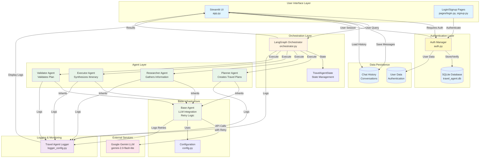
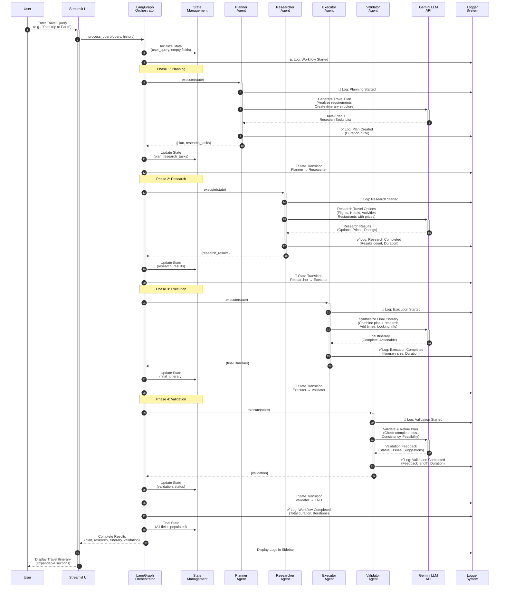
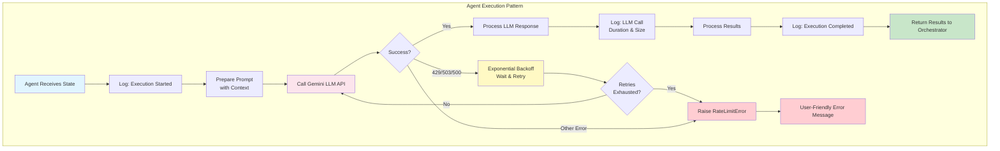
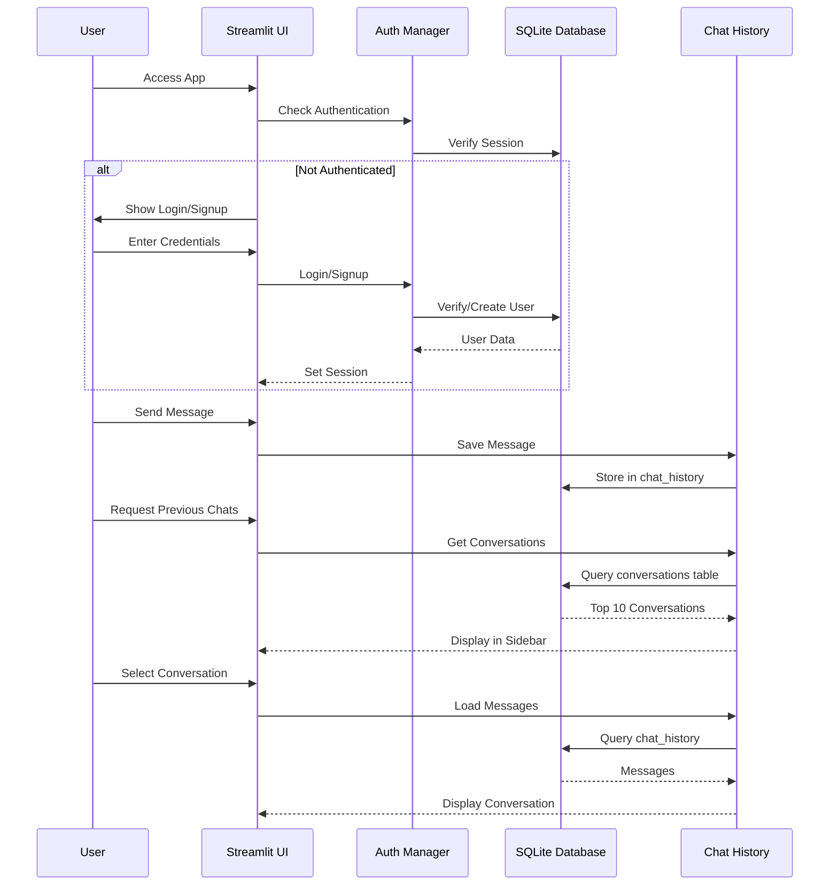

# Travel Buddy

An intelligent, multi-agent travel planning system powered by Gemini LLM and orchestrated with LangGraph.

## Features

- 🤖 **Multi-Agent Architecture**: Specialized agents for planning, research, execution, and validation
- 🧠 **Gemini LLM Integration**: Powered by Google's Gemini 2.0 Flash Lite model
- 🔄 **LangGraph Orchestration**: Coordinated workflow between agents
- 💬 **Streamlit UI**: Interactive chat interface for travel planning
- 📋 **Comprehensive Planning**: Creates detailed itineraries with research and validation
- 📊 **Operation Logging**: Real-time logging and monitoring of all agent operations
- 🔐 **User Authentication**: Secure login/signup system with SQLite database
- 💾 **Chat History Persistence**: All conversations saved and retrievable per user
- 📚 **Conversation Management**: Navigate through top 10 previous conversations
- 🔄 **Error Handling**: Automatic retry with exponential backoff for rate limits (429 errors)
- 🛡️ **Password Security**: PBKDF2 hashing with salt for secure password storage
- 📥 **PDF Export**: Download travel plans as well-formatted PDF documents
- 🚀 **Next Steps Guidance**: Always includes actionable next steps for plan improvement

## Architecture

The system uses a multi-agent architecture orchestrated by LangGraph, with each agent specializing in a specific aspect of travel planning.

### System Architecture Diagram



### Workflow Diagram

#### Detailed Sequence Flow



#### Workflow State Flow


#### Agent Execution Flow with Error Handling



#### Authentication & Data Flow



### Agent Responsibilities

1. **Planner Agent**: Creates comprehensive travel plans based on user requirements
   - Analyzes user requirements (destination, dates, budget, preferences)
   - Creates day-by-day itinerary structure
   - Identifies research tasks needed
   - Provides budget estimates

2. **Researcher Agent**: Gathers detailed information about flights, hotels, activities, etc.
   - Researches flights, hotels, restaurants, activities
   - Provides multiple options with prices and ratings
   - Compares options and makes recommendations
   - Supplies booking information

3. **Executor Agent**: Synthesizes the plan and research into a final, actionable itinerary
   - Combines plan and research into executable itinerary
   - Adds specific times and details
   - Includes booking information and links
   - Provides travel tips and reminders

4. **Validator Agent**: Validates and refines the travel plan for completeness and feasibility
   - Checks for completeness and consistency
   - Validates dates, times, and locations
   - Verifies budget realism
   - Suggests improvements

## Setup

### 1. Install Dependencies

```bash
pip install -r requirements.txt
```

### 2. Configure API Key

Create a `.env` file in the root directory:

```bash
cp .env.example .env
```

Edit `.env` and add your Gemini API key:

```
GEMINI_API_KEY=your_gemini_api_key_here
```

You can get a Gemini API key from [Google AI Studio](https://makersuite.google.com/app/apikey).

### 3. Run the Application

```bash
streamlit run app.py
```

The application will open in your browser at `http://localhost:8501`.

## Usage

1. **Sign Up / Login**
   - First-time users: Click "Sign Up" to create an account
   - Existing users: Click "Login" to access your account
   - All user data is securely stored in SQLite database

2. **Start Planning**
   - Enter your travel query in the chat input (e.g., "Plan a 5-day trip to Paris in March")
   - The system will:
     - Create a detailed travel plan
     - Research flights, hotels, and activities
     - Generate a final itinerary
     - Validate the plan

3. **Review Results**
   - View results in expandable sections
   - Check operation logs in the sidebar
   - All conversations are automatically saved

4. **Navigate Previous Chats**
   - View top 10 previous conversations in the sidebar
   - Click any conversation to load and continue
   - Start new conversations with the "➕ New Conversation" button

5. **Download PDFs**
   - Click "📥 Download as PDF" in any assistant response
   - Get professionally formatted PDF with all travel plan details
   - PDFs include: Travel Plan, Research Results, Final Itinerary, Validation, and Next Steps
   - Perfect for offline access or sharing

6. **Error Handling**
   - System automatically retries on rate limit errors (429)
   - Exponential backoff prevents API overload
   - User-friendly error messages guide you

7. **Next Steps for Improvement**
   - Every response includes actionable next steps
   - Suggestions for making plans more promising
   - Guidance on additional information needed
   - Recommendations for plan enhancement

## Example Queries

- "I want to plan a 7-day trip to Tokyo in April with a budget of $3000"
- "Help me plan a weekend getaway to New York City"
- "Create an itinerary for a 10-day European tour visiting Paris, Rome, and Barcelona"

## Project Structure

```
travel-agent-1/
├── src/
│   └── travel_agent/          # Main package
│       ├── __init__.py
│       ├── agents/            # Agent modules
│       │   ├── __init__.py
│       │   ├── base_agent.py          # Base agent with retry logic
│       │   ├── planner_agent.py       # Travel planning agent
│       │   ├── researcher_agent.py   # Research agent
│       │   ├── executor_agent.py      # Execution agent
│       │   └── validator_agent.py     # Validation agent
│       ├── core/              # Core modules
│       │   ├── __init__.py
│       │   ├── config.py             # Application configuration
│       │   ├── database.py            # SQLite database operations
│       │   ├── auth.py                # Authentication manager
│       │   ├── logger_config.py       # Logging configuration
│       │   └── orchestrator.py       # LangGraph workflow orchestrator
│       └── utils/             # Utility modules
│           ├── __init__.py
│           └── pdf_generator.py       # PDF generation utility
├── pages/                     # Streamlit pages (must be at root)
│   ├── login.py               # Login page
│   ├── signup.py              # Signup page
│   ├── about.py               # About page
│   └── operation_logs.py         # Operation logs page
├── tests/                      # Test files
│   └── __init__.py
├── docs/                       # Documentation
├── scripts/                    # Utility scripts
│   └── setup.sh                # Setup script
├── config/                     # Configuration files
├── app.py                      # Main Streamlit application (entry point)
├── requirements.txt            # Python dependencies
├── setup.py                    # Package setup script
├── pyproject.toml              # Modern Python project configuration
├── MANIFEST.in                 # Package manifest
├── .env.example                # Environment variables template
├── .gitignore                  # Git ignore rules
├── travel_agent.db             # SQLite database (auto-created)
├── README.md                   # This file
└── QUICKSTART.md               # Quick start guide
```

## Database Schema

The application uses SQLite with the following tables:

### Users Table
- `id`: Primary key
- `username`: Unique username
- `email`: Unique email address
- `password_hash`: Securely hashed password (PBKDF2)
- `full_name`: User's full name
- `created_at`: Account creation timestamp
- `last_login`: Last login timestamp
- `is_active`: Account status

### Chat History Table
- `id`: Primary key
- `user_id`: Foreign key to users
- `role`: Message role (user/assistant)
- `content`: Message content
- `created_at`: Message timestamp
- `session_id`: Optional session identifier
- `conversation_id`: Conversation grouping identifier

### Conversations Table
- `id`: Primary key
- `user_id`: Foreign key to users
- `conversation_id`: Unique conversation identifier
- `title`: Conversation title (first 50 chars)
- `first_message`: First message preview
- `created_at`: Conversation start time
- `updated_at`: Last message time
- `message_count`: Total messages in conversation

## Error Handling

### Rate Limiting (429 Errors)
- **Automatic Retry**: Up to 3 retries with exponential backoff
- **Backoff Strategy**: 2s → 4s → 8s (with jitter)
- **User Feedback**: Clear error messages with suggestions
- **Logging**: All retry attempts are logged

### Retryable Errors
- 429 (Resource Exhausted)
- 503 (Service Unavailable)
- 500 (Internal Server Error)
- Timeout errors

### Configuration
```python
MAX_RETRIES = 3
INITIAL_RETRY_DELAY = 2  # seconds
MAX_RETRY_DELAY = 60      # seconds
RETRY_BACKOFF_MULTIPLIER = 2
```

## Technologies

- **Streamlit**: UI framework for interactive web applications
- **LangGraph**: Workflow orchestration for multi-agent systems
- **LangChain**: LLM integration framework
- **Google Gemini**: Large language model (gemini-2.0-flash-lite)
- **SQLite**: Lightweight database for user data and chat history
- **ReportLab**: PDF generation library for document creation
- **Python**: Core programming language
- **PBKDF2**: Password hashing algorithm for security

## Security Features

- **Password Hashing**: PBKDF2 with SHA-256, 100,000 iterations
- **Salt**: Unique salt per password
- **SQL Injection Protection**: Parameterized queries
- **Session Management**: Secure session state handling
- **Input Validation**: Username, email, and password validation

## Performance Features

- **Database Indexing**: Optimized queries with indexes
- **Conversation Caching**: Fast retrieval of chat history
- **Retry Logic**: Automatic handling of transient errors
- **Exponential Backoff**: Prevents API overload
- **Efficient State Management**: LangGraph state optimization

## PDF Export Features

- **Professional Formatting**: Clean, well-structured PDF documents with proper typography
- **Complete Content**: Includes all sections (Plan, Research, Itinerary, Validation, Next Steps)
- **Typography**: Professional fonts, spacing, and layout for readability
- **Downloadable**: One-click download from any assistant response dropdown
- **Print-Ready**: Formatted for printing or sharing
- **Timestamped**: Each PDF includes generation date and time
- **Well-Organized**: Clear section headers, proper spacing, and visual hierarchy

## Next Steps Feature

Every travel plan response includes a dedicated **"Next Steps for Improvement"** section that provides:

- **Actionable Guidance**: Specific steps to enhance the plan
- **Missing Information**: Details that would make the plan more promising
- **Enhancement Suggestions**: Ways to personalize and improve the itinerary
- **Research Recommendations**: Additional information to gather
- **Budget Optimization**: Cost-saving opportunities
- **Alternative Options**: Backup plans and alternatives
- **Personalization Tips**: How to customize the plan further

This ensures users always have clear direction on how to refine and improve their travel plans, making each iteration more comprehensive and tailored to their needs.

## License

MIT License

