# Travel Agent Chatbot

An intelligent, multi-agent travel planning system powered by Gemini LLM and orchestrated with LangGraph.

## Features

- 🤖 **Multi-Agent Architecture**: Specialized agents for planning, research, execution, and validation
- 🧠 **Gemini LLM Integration**: Powered by Google's Gemini 2.0 Flash Lite model
- 🔄 **LangGraph Orchestration**: Coordinated workflow between agents
- 💬 **Streamlit UI**: Interactive chat interface for travel planning
- 📋 **Comprehensive Planning**: Creates detailed itineraries with research and validation
- 📊 **Operation Logging**: Real-time logging and monitoring of all agent operations

## Architecture

The system uses a multi-agent architecture orchestrated by LangGraph, with each agent specializing in a specific aspect of travel planning.

### System Architecture Diagram


### Workflow Diagram

#### Detailed Sequence Flow

```mermaid
sequenceDiagram
    autonumber
    participant User
    participant UI as Streamlit UI
    participant Orch as LangGraph<br/>Orchestrator
    participant State as State<br/>Management
    participant Planner as Planner<br/>Agent
    participant Researcher as Researcher<br/>Agent
    participant Executor as Executor<br/>Agent
    participant Validator as Validator<br/>Agent
    participant LLM as Gemini LLM<br/>API
    participant Logger as Logger<br/>System

    User->>+UI: Enter Travel Query<br/>(e.g., "Plan trip to Paris")
    UI->>+Orch: process_query(query, history)
    Orch->>+State: Initialize State<br/>(user_query, empty fields)
    Orch->>Logger: 📊 Log: Workflow Started
    
    Note over Orch,State: Phase 1: Planning
    Orch->>+Planner: execute(state)
    Planner->>Logger: 📝 Log: Planning Started
    Planner->>+LLM: Generate Travel Plan<br/>(Analyze requirements,<br/>Create itinerary structure)
    LLM-->>-Planner: Travel Plan +<br/>Research Tasks List
    Planner->>Logger: ✅ Log: Plan Created<br/>(Duration, Size)
    Planner-->>-Orch: {plan, research_tasks}
    Orch->>State: Update State<br/>(plan, research_tasks)
    Orch->>Logger: 🔄 State Transition:<br/>Planner → Researcher
    
    Note over Orch,State: Phase 2: Research
    Orch->>+Researcher: execute(state)
    Researcher->>Logger: 📝 Log: Research Started
    Researcher->>+LLM: Research Travel Options<br/>(Flights, Hotels, Activities,<br/>Restaurants with prices)
    LLM-->>-Researcher: Research Results<br/>(Options, Prices, Ratings)
    Researcher->>Logger: ✅ Log: Research Completed<br/>(Results count, Duration)
    Researcher-->>-Orch: {research_results}
    Orch->>State: Update State<br/>(research_results)
    Orch->>Logger: 🔄 State Transition:<br/>Researcher → Executor
    
    Note over Orch,State: Phase 3: Execution
    Orch->>+Executor: execute(state)
    Executor->>Logger: 📝 Log: Execution Started
    Executor->>+LLM: Synthesize Final Itinerary<br/>(Combine plan + research,<br/>Add times, booking info)
    LLM-->>-Executor: Final Itinerary<br/>(Complete, Actionable)
    Executor->>Logger: ✅ Log: Execution Completed<br/>(Itinerary size, Duration)
    Executor-->>-Orch: {final_itinerary}
    Orch->>State: Update State<br/>(final_itinerary)
    Orch->>Logger: 🔄 State Transition:<br/>Executor → Validator
    
    Note over Orch,State: Phase 4: Validation
    Orch->>+Validator: execute(state)
    Validator->>Logger: 📝 Log: Validation Started
    Validator->>+LLM: Validate & Refine Plan<br/>(Check completeness,<br/>Consistency, Feasibility)
    LLM-->>-Validator: Validation Feedback<br/>(Status, Issues, Suggestions)
    Validator->>Logger: ✅ Log: Validation Completed<br/>(Feedback length, Duration)
    Validator-->>-Orch: {validation}
    Orch->>State: Update State<br/>(validation, status)
    Orch->>Logger: 🔄 State Transition:<br/>Validator → END
    
    Orch->>Logger: ✅ Log: Workflow Completed<br/>(Total duration, Iterations)
    Orch->>State: Final State<br/>(All fields populated)
    Orch-->>-UI: Complete Results<br/>(plan, research, itinerary, validation)
    UI->>Logger: Display Logs in Sidebar
    UI-->>-User: Display Travel Itinerary<br/>(Expandable sections)
```



#### Workflow State Flow


#### Agent Execution Flow


### Agent Responsibilities

1. **Planner Agent**: Creates comprehensive travel plans based on user requirements
   - Analyzes user requirements (destination, dates, budget, preferences)
   - Creates day-by-day itinerary structure
   - Identifies research tasks needed
   - Provides budget estimates

2. **Researcher Agent**: Gathers detailed information about flights, hotels, activities, etc.
   - Researches flights, hotels, restaurants, activities
   - Provides multiple options with prices and ratings
   - Compares options and makes recommendations
   - Supplies booking information

3. **Executor Agent**: Synthesizes the plan and research into a final, actionable itinerary
   - Combines plan and research into executable itinerary
   - Adds specific times and details
   - Includes booking information and links
   - Provides travel tips and reminders

4. **Validator Agent**: Validates and refines the travel plan for completeness and feasibility
   - Checks for completeness and consistency
   - Validates dates, times, and locations
   - Verifies budget realism
   - Suggests improvements

## Setup

### 1. Install Dependencies

```bash
pip install -r requirements.txt
```

### 2. Configure API Key

Create a `.env` file in the root directory:

```bash
cp .env.example .env
```

Edit `.env` and add your Gemini API key:

```
GEMINI_API_KEY=your_gemini_api_key_here
```

You can get a Gemini API key from [Google AI Studio](https://makersuite.google.com/app/apikey).

### 3. Run the Application

```bash
streamlit run app.py
```

The application will open in your browser at `http://localhost:8501`.

## Usage

1. Open the Streamlit app
2. Enter your travel query in the chat input (e.g., "Plan a 5-day trip to Paris in March")
3. The system will:
   - Create a detailed travel plan
   - Research flights, hotels, and activities
   - Generate a final itinerary
   - Validate the plan
4. Review the results in the chat interface

## Example Queries

- "I want to plan a 7-day trip to Tokyo in April with a budget of $3000"
- "Help me plan a weekend getaway to New York City"
- "Create an itinerary for a 10-day European tour visiting Paris, Rome, and Barcelona"

## Project Structure

```
travel-agent-1/
├── agents/
│   ├── __init__.py
│   ├── base_agent.py
│   ├── planner_agent.py
│   ├── researcher_agent.py
│   ├── executor_agent.py
│   └── validator_agent.py
├── orchestrator.py
├── app.py
├── config.py
├── requirements.txt
├── .env.example
└── README.md
```

## Technologies

- **Streamlit**: UI framework
- **LangGraph**: Workflow orchestration
- **LangChain**: LLM integration framework
- **Google Gemini**: Large language model
- **Python**: Core language

## License

MIT License

